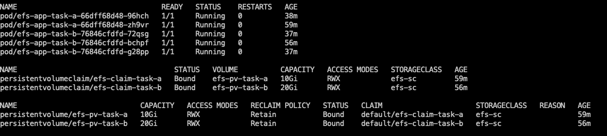

efs-on-fargate-multi-filesystem-demo
===

This repo demonstrates a scenario in which you have a base application run on EKS Fargate which needs to be deployed separately to mount different EFS filesystem. It utilizes [kustomize](https://github.com/kubernetes-sigs/kustomize) for the Kubernetes manifests templating and customization.

In this demo, I assume you have 2 groups of task pods, `task-a` and `task-b`. Each runs with the same image, but they need to access different filesystems for their customized data. Each task-generated pod would be labeled and named with suffix accordingly. eg. `efs-app-task-a`

## Prerequisites
1. You need to create 2 EFS filesystems. Remember to allow inbound access for port `2049` inside of your mount target security group, otherwise the volume mount would fail.
2. You have a EKS Cluster created, and with a default Fargate profile created.
3. You have `kubectl` installed, and have full control of your cluster.


## Setup
1. Clone this repo locally.
2. Replace the value of `volumeHandle` field with your EFS filesystem id inside `deploy/overlay/task-x/pv-pvc.yaml`.
3. Setup [efs-csi-driver](https://aws.amazon.com/blogs/aws/new-aws-fargate-for-amazon-eks-now-supports-amazon-efs/) and create storage class by executing `kubectl apply -f setup/`


## Deploy
To deploy `task-a`, simply run
```
kubectl apply -k deploy/overlay/task-a
```
For `task-b`, run
```
kubectl apply -k deploy/overlay/task-b
```

If everything goes well, it would look similar like this.

